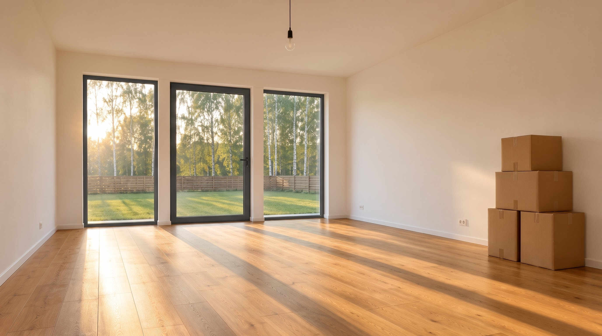
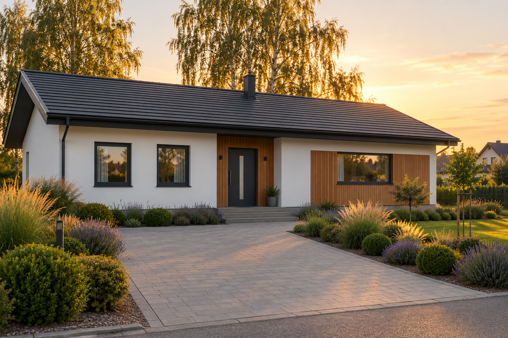
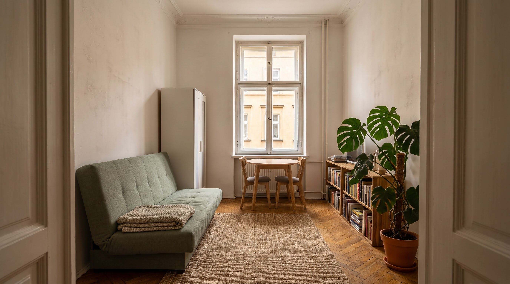
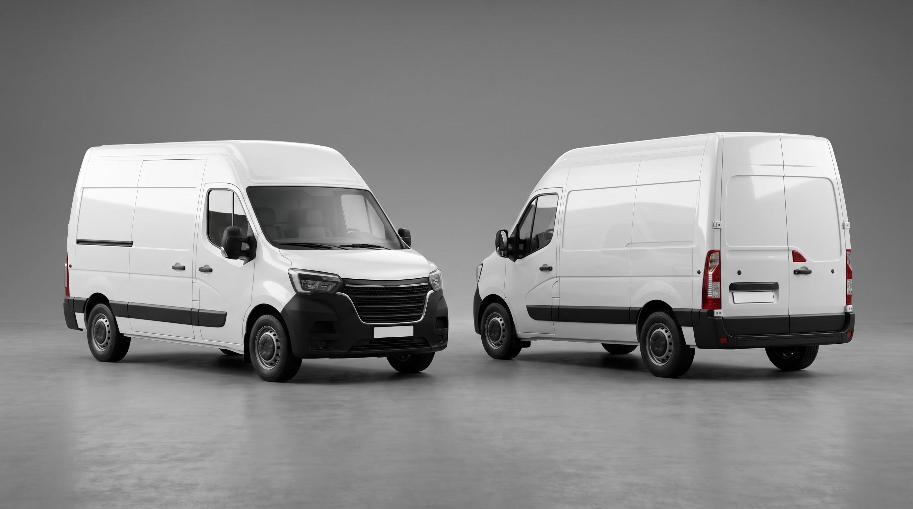

# Lokacje

Referencje robimy tylko dla miejsc, które powtarzają się w kilku ujęciach (zob. `scenariusz-zostan-tu.md`).

| Lokacja | Ujęcia | Referencja |
|---|---|---|
| Pusty salon w domu | 23–30, 32–33 | ✅ `referencje/salon.jpg` |
| Dom z zewnątrz (front, podjazd) | 20, 21, 22, 31, 34 | ✅ `referencje/dom.png` |
| Pokój w kawalerce | 5, 6, 13, 14, 17 | ✅ `referencje/kawalerka.jpg` |
| Kuchnia w kawalerce | 2, 3 | ♻️ klatka z klipu 01 |

## SALON



```text
SALON: empty living room of a new suburban house. The far wall is three tall floor-to-ceiling windows in slim matte anthracite frames, the middle one a glass door with a black handle to the garden: green lawn, a wooden slat fence and tall birch trees beyond. Warm-white plastered walls, honey-oak floorboards running toward the windows, a single bare bulb on a black cable hanging from the ceiling center. A stack of four plain brown cardboard moving boxes against the right wall. Garden side faces west: late-afternoon sun shines in low through the windows.
```

**Uwaga:** na referencji są 4 kartony (w prompcie było 5). W promptach wideo piszemy więc o 4 kartonach, zgodnie z referencją.

**Zrobione:** ramy okien w salonie zmienione edycją w Nano Banana Pro z białych na antracytowe, żeby pasowały do domu z zewnątrz.

## DOM



```text
DOM: a wide modern single-storey suburban house, long side facing the street, low-pitched gable roof with matte graphite tiles and one slim graphite chimney, smooth white plastered walls. A central entrance framed by vertical warm cedar cladding, an anthracite front door with a narrow vertical frosted glass strip, two low concrete steps. Two square anthracite-framed windows left of the door; a wide horizontal window in a second cedar-clad section on the right. A wide pale-grey paved driveway leads to the entrance through a front garden of ornamental grasses, clipped boxwood and lavender. Tall birch trees rise behind the roof.
```

**Uwaga:** na referencji słońce zachodzi z prawej strony, za domem, a fasada jest ciepło oświetlona, nie w cieniu. W promptach wideo trzymamy się tego, co jest na referencji.

## KAWALERKA



```text
KAWALERKA: a small narrow studio room in an old Polish tenement, seen from the white double entrance door. High ceiling with an ornate plaster cornice, warm-white walls, worn honey-oak herringbone parquet, a woven jute rug. On the far wall, one tall old double-casement window with white wooden frames looking at the pale ochre tenement facade across the street, a white radiator under it, a small round light-oak table with two chairs. Along the left wall, a compact two-seater mid-century sofa bed in deep bottle-green velvet on slim tapered oak legs, a narrow white wardrobe behind it. Along the right wall, a long low oak bookshelf packed with books and a tall monstera in a terracotta pot on the floor in the right corner.
```

**Wersja z 9.10:** nowa referencja z butelkowo-zieloną rozkładaną kanapą mid-century (edycja NBP, pokój zachowany 1:1). Stara wersja z szałwiową wersalką i kocem: `referencje/kawalerka-wersalka.jpg`.

**Uwaga:** światło na referencji jest przygaszone i chłodnawe. W ujęciach dziennych możemy dodać słońce wpadające przez okno. Kontrast między ciemną, ciasną kawalerką a jasnym domem jest celowy.

## KAWALERKA: nowa kanapa ✅ (zrobione 9.10)

Cel: w tym samym kadrze stara kanapa szałwiowa zamieniona na kompaktową dwuosobową sofę mid-century z butelkowo-zielonego weluru na dębowych nóżkach.

**Diagnoza wcześniejszych prób:** NBP przerysowywał cały pokój. Prawdopodobne przyczyny:
1. Proporcja wyjścia inna niż oryginał. `kawalerka.jpg` ma 2752×1536, czyli **16:9**. Ustaw 16:9 w UI, bez „auto”.
2. Model wymyślał kanapę i przy okazji „poprawiał” resztę. Dlatego najpierw robimy kanapę jako osobny rekwizyt, a potem edycję z dwiema referencjami.

### Krok 1: planszka kanapy (NBP, rekwizyt)

Parametry w UI: 4:3, 2k. Kąt kamery jak na kanapę w kawalerce (z przodu i z prawej, z wysokości oczu), żeby NBP nie musiał jej obracać.

```text
Photorealistic three-quarter product shot of a compact two-seater mid-century modern sofa, seen from the front-right at standing eye level, on a plain warm light-grey studio floor against a seamless light-grey backdrop, soft directional key light from the upper left, gentle natural shadow falloff, isolated subject. The sofa is about 150 cm wide and 80 cm deep with a low slim back: two plump rectangular back cushions, one long seat cushion with neat piped edges, narrow gently rounded arms. Upholstered in deep bottle-green cotton velvet with a soft sheen where the light catches the pile. Four slim tapered solid oak legs, natural honey oak with a matte oil finish, splayed slightly outward near the corners. Plain unbranded upholstery, clean seams. Shot on ARRI Alexa Mini LF with ARRI Signature Prime lens, clean modern digital capture, crisp natural detail, true-to-life colour.
```

Zapisz jako `referencje/kanapa.jpg`.

**Wynik (9.10):** wariant zaakceptowany. Butelkowy welur, dwie poduszki oparcia, jedno siedzisko z lamówką, rozchylone dębowe nóżki, kąt z przodu i z lewej strony kadru (jak w kawalerce). Potrzebny oryginał pliku, bo mamy tylko zrzut ekranu z telefonu.

**Decyzja fabularna:** kanapa jest **rozkładana**, a mechanizm schowany pod siedziskiem. Złożona wygląda dokładnie jak na referencji. Rozłożoną robimy osobno tylko wtedy, gdy któreś ujęcie ją pokaże.

### Krok 2: podmiana kanapy w kawalerce (NBP, edycja)

Parametry w UI: **16:9**, 2k lub 4k. Kolejność referencji: **obraz 1 = `kawalerka.jpg`**, **obraz 2 = `kanapa.jpg`**.

```text
Edit image 1: replace the sage-green sofa bed along the left wall with the bottle-green velvet sofa from image 2.

CHANGE: the sofa only. The new sofa stands against the left wall in the same spot as the old one, its back to the wall, facing the right side of the room, same three-quarter view as in image 2. It is smaller than the old sofa bed: the floor it frees shows continuous herringbone parquet and the edge of the jute rug, and the left wall above it is continuous warm-white plaster. The folded oatmeal knit blanket is removed together with the old sofa: the new sofa is bare and empty, its seat and back cushions plain bottle-green velvet only.

PRESERVE EXACTLY:
- Camera position, height, lens and framing: the white double-door leaves on both edges of the frame, one-point perspective toward the window
- Room size and proportions, ceiling height, plaster cornice, white pipes in the right corner
- The tall white double-casement window, the ochre facade across the street, the white radiator
- The narrow white wardrobe, the round light-oak table and two chairs
- The low oak bookshelf with all books, the monstera in the terracotta pot
- The jute rug position, the herringbone parquet pattern
- Light direction, colour grade, contrast, grain

ONLY CHANGE: the sofa. 100% identical otherwise.
```

**Wynik 1 (9.10):** pokój przetrwał. Drzwi, okno, szafa, stolik, regał i monstera są w tych samych miejscach, a kanapa jest podmieniona. Dwie poprawki: koc ma zniknąć (zmiana w prompcie powyżej), a wyjście było w 768p, więc generujemy ponownie w 2k lub 4k.

**Wynik 2 (9.10): ✅ zaakceptowany.** Bez koca, 2752×1536, pokój zachowany. Zapisany jako `referencje/kawalerka.jpg`.

Jeśli NBP dalej rusza pokój, jedna zmiana na iterację: najpierw dopisz na początku „Keep the exact same composition and camera as image 1.”. Potem spróbuj **GPT Image 2** (ostatnia deska ratunku, ale lokalnie jest mocny) z tym samym promptem i obiema referencjami.

### Plan C: kawalerka od nowa (Soul Cinema, twarde wymiary)

Tylko jeśli kroki 1–2 zawiodą. Parametry w UI: 16:9, 2k, referencja: `kawalerka.jpg`.

```text
Eye-level straight-on wide shot from the open white double door of a small narrow studio room in an old Polish tenement, the two door leaves framing both edges of the frame, one-point perspective toward the window. The room is about 3 metres wide and 4.5 metres deep with a 3.2-metre ceiling and an ornate plaster cornice, warm-white walls, worn honey-oak herringbone parquet, a woven jute rug. On the far wall one tall old double-casement window with white wooden frames looking at a pale ochre tenement facade, a white radiator under it, a small round light-oak table with two chairs. Along the left wall a compact two-seater mid-century sofa in deep bottle-green velvet on slim tapered oak legs, a folded oatmeal knit blanket on the seat, a narrow white wardrobe behind it. Along the right wall a long low oak bookshelf packed with books and a tall monstera in a terracotta pot in the corner. Soft overcast daylight from the window, gentle falloff toward the door. Palette of 60% warm white and oatmeal, 30% honey oak, 10% bottle green. Rule of thirds. Clean modern digital cinematic capture, true-to-life colour.
```

## Rekwizyty

### BUS



```text
BUS: a large plain white panel van with a high roof and a long cargo box, sliding side door, black plastic bumpers and side rub strips, black steel wheels, a horizontal black front grille with slim angular headlights, tall red vertical tail lights and twin rear cargo doors. Blank white license plates, plain unbranded bodywork with no badges or lettering.
```

Ujęcia: 18, 19, 20. Na referencji widać przód i tył, a światło jest studyjne, neutralne.

**Uwaga:** tablice rejestracyjne są puste i tak zostają. W promptach wideo piszemy „blank white license plates”, żeby model nie wymyślił napisów.
