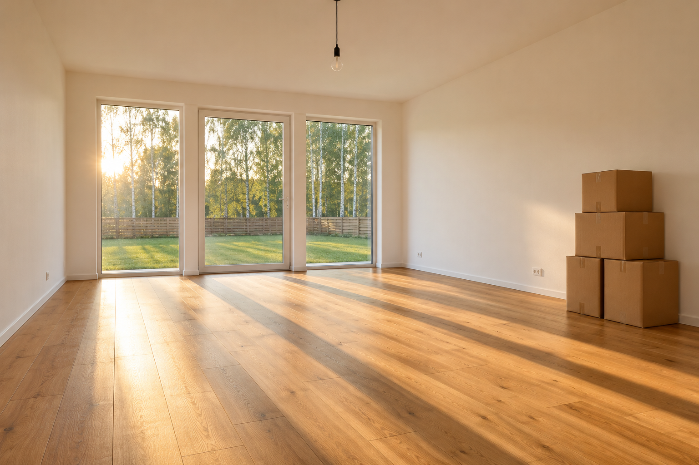

# Lokacje

Referencje robimy tylko dla miejsc, które powtarzają się w kilku ujęciach (zob. `scenariusz-zostan-tu.md`).

| Lokacja | Ujęcia | Referencja |
|---|---|---|
| Pusty salon w domu | 23–30, 32–33 | ✅ `referencje/salon.png` |
| Dom z zewnątrz (front, ganek, podjazd) | 20, 21, 22, 31, 34 | ⏳ do zrobienia |
| Pokój w kawalerce | 5, 6, 13, 14, 17 | ⏳ do zrobienia |
| Kuchnia w kawalerce | 2, 3 | ♻️ klatka z klipu 01 |

## SALON



```text
SALON: empty living room of a new suburban house. The far wall is three tall floor-to-ceiling windows in slim white frames, the middle one a glass door to the garden: green lawn, a wooden slat fence and tall birch trees beyond. Warm-white plastered walls, honey-oak floorboards running toward the windows, a single bare bulb on a black cable hanging from the ceiling center. A stack of four plain brown cardboard moving boxes against the right wall. Garden side faces west: late-afternoon sun shines in low through the windows.
```

**Uwaga:** na referencji są 4 kartony (w prompcie było 5). W promptach wideo piszemy więc o 4 kartonach, zgodnie z referencją.
