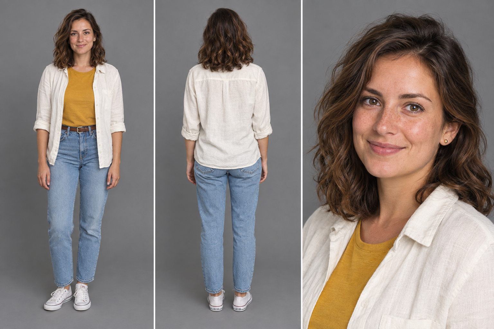
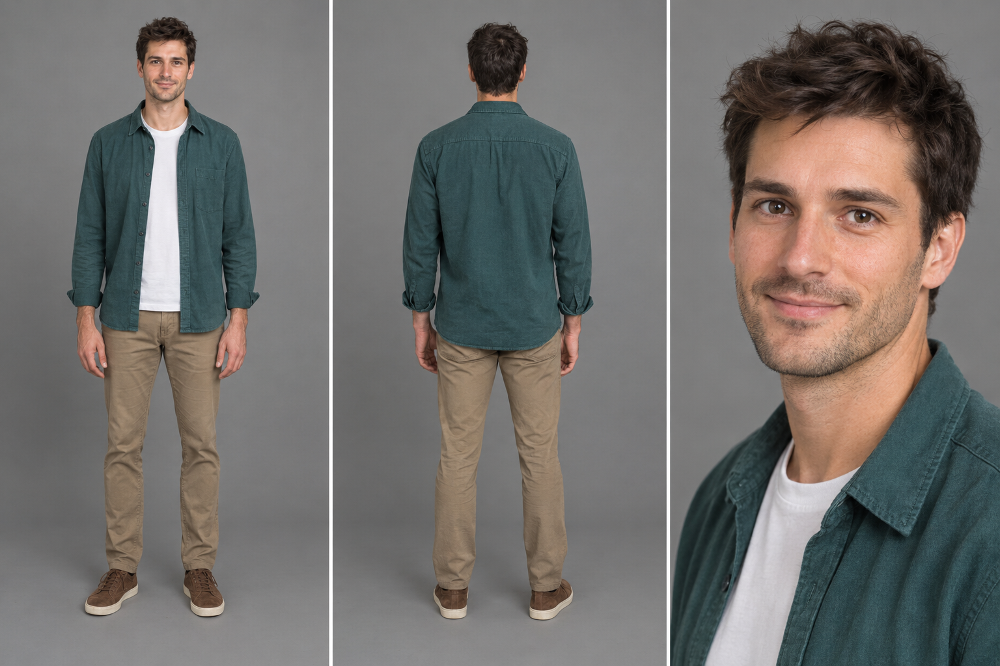
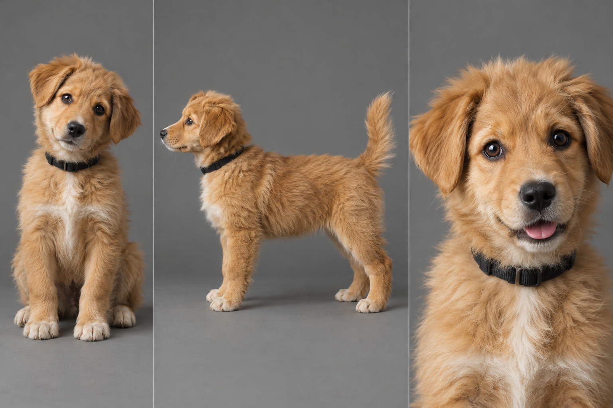

# Postacie

Referencje wgrywamy do generatora z tagami `@ANIA` i `@TOMEK`.
Opisy poniżej to minimalne kotwice. Twarz, sylwetkę i strój i tak niesie zdjęcie referencyjne.

## @ANIA



```text
@ANIA: early 30s slim woman, wavy shoulder-length dark brown hair with caramel ends, light freckles, small gold stud earring, cream linen overshirt with rolled sleeves over a mustard t-shirt, light blue jeans, brown belt, white sneakers. 100% matches the reference.
```

**Głos (wklejać dosłownie, gdy mówi):**

```text
Voice @ANIA: "A 30-year-old Polish woman, soft natural voice with a slight husk; quick, bright delivery, the end of the sentence lifting with playful guilt."
```

**Charakter w dotychczasowych scenach:** ciepła, impulsywna, robi coś pierwsza, a pyta potem. Kiedy się denerwuje, mruga seriami i przeskakuje wzrokiem. Rozbraja uśmiechem.

## @TOMEK



```text
@TOMEK: early 30s lean man, tousled dark brown hair, short stubble, dark teal overshirt open over a white t-shirt, khaki chinos, brown suede sneakers. 100% matches the reference.
```

**Głos (wklejać dosłownie, gdy mówi):**

```text
Voice @TOMEK: "A 30-year-old Polish man, warm low baritone with a slight rasp; relaxed, unhurried delivery; dry and teasing, the joke barely hiding a smile."
```

**Charakter w dotychczasowych scenach:** spokojny i suchy żartowniś. Reaguje bezruchem: przerwana czynność, oczy ruszają się przed głową. Gra dwie prawdy naraz („to zły pomysł” i „już to kocham”).

## @PIESEK



```text
@PIESEK: a 3-month-old fluffy mixed-breed puppy, wavy medium-length honey-gold coat, cream-white bib down the center of the chest, cream paws, soft floppy ears, round dark brown eyes, black nose, plain black fabric collar. 100% matches the reference.
```

**Charakter:** wieczny entuzjasta. Ogon w ruchu, przekrzywia głowę, kiedy coś go ciekawi, a chaos zostawia za sobą 🐶

**Uwaga:** na planszce sierść jest nieco bardziej miodowo-pomarańczowa niż u szczeniaka w klipie z targu (03), gdzie pies był jaśniejszy, kremowo-złoty. Przy ciepłym świetle żarówek na targu ta różnica nie rzuca się w oczy.
